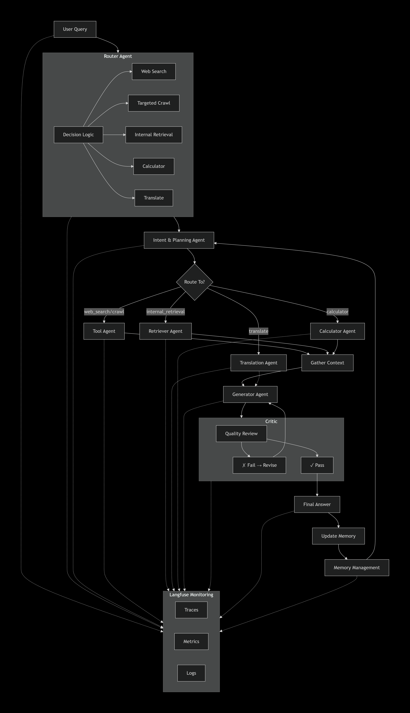

# LangChain Agentic Pipeline with Streaming API

A production-ready multi-agent LLM pipeline built with **LangChain**, **LangGraph**, and **FastAPI** that supports real-time streaming responses.

## 🌟 Features

- **Multi-Agent Architecture**: Router, Intent Planning, Retrieval, Translator, Generator, and Critic agents.
- **Advanced Web Crawling**: Integration with **Crawl4AI** for JavaScript rendering and clean Markdown extraction.
- **Multilingual Support**: Built-in **Translation Agent** for universal output in Chinese, Spanish, French, German, and Japanese.
- **Hierarchical Memory**: Scalable conversation history using multi-level summarization for 100+ message sessions.
- **Observability**: Full tracing and monitoring integrated with **Langfuse**.
- **Real-time Streaming**: Progressive responses via Server-Sent Events (SSE).
- **Persistent Feedback**: Built-in thumbs up/down system with MongoDB storage and analytics.
- **Smart UI**: Modern Streamlit dashboard with sticky headers, session history (24h filter), and tool-usage badges.

## 📋 Architecture



## 🚀 Quick Start

### 1. Installation

```bash
# Clone or navigate to the project
cd c:\Projects\llm-framework\orchestrator

# Install dependencies using uv (recommended for speed)
uv pip install -r requirements.txt

# Install Playwright browsers (for Advanced Crawler)
uv run playwright install chromium
```

### 2. Configuration

Create a `.env` file from the example:

```bash
cp .env.example .env
```

Edit `.env` and add your API keys:

```env
OPENAI_API_KEY=sk-your-openai-key-here
TAVILY_API_KEY=tvly-your-tavily-key-here
MONGO_URL=your-mongo-url-here
LANGFUSE_PUBLIC_KEY=your-public-key
LANGFUSE_SECRET_KEY=your-secret-key
```

**Get API Keys:**
- OpenAI: https://platform.openai.com/api-keys
- Tavily (for web search): https://tavily.com
- MongoDB: https://www.mongodb.com
- Langfuse: https://langfuse.com

### 3. Run the API

```bash
# Option 1: Direct Python
uv run api.py

# Option 2: Using uvicorn (recommended for production)
uvicorn api:app --reload --port 8000

# Option 3: Production mode
uvicorn api:app --host 0.0.0.0 --port 8000 --workers 4
```

The API will be available at: `http://localhost:8000`

### 4. Test the API

```bash
# Run the example client
uv run example_client.py
'''

# Test health endpoint
curl http://localhost:8000/health

## 📡 API Endpoints

### Health Check

```bash
GET /health
```

**Response:**
```json
{
  "status": "healthy",
  "openai_configured": true,
  "tavily_configured": true,
  "endpoints": {
    "query": "/api/query",
    "stream": "/api/stream"
  }
}
```

### Non-Streaming Query

```bash
POST /api/query
```

**Request:**
```json
{
  "query": "What are the latest developments in AI?",
  "chat_history": [
    {"role": "user", "content": "Previous question"},
    {"role": "assistant", "content": "Previous answer"}
  ],
  "model": "gpt-4o-mini",
  "temperature": 0.7
}
```

**Response:**
```json
{
  "success": true,
  "query": "What are the latest developments in AI?",
  "final_answer": "Based on recent web searches...",
  "intent": "web_search",
  "routing_decision": "web_search",
  "citations": [0, 1, 2],
  "error": null
}
```

### Streaming Query

```bash
POST /api/stream
```

**Request:** Same as `/api/query`

**Response:** Server-Sent Events (SSE) stream

```
data: {"event": "start", "query": "..."}

data: {"node": "router", "state": {...}}

data: {"node": "generator", "state": {"draft_answer": "..."}}

data: {"event": "complete"}
```

### Unified Chat Endpoint

```bash
POST /api/chat
```

Automatically routes to streaming or non-streaming based on `stream` flag.

## 💻 Usage Examples

### Python Client

```python
from example_client import AgenticPipelineClient

client = AgenticPipelineClient("http://localhost:8000")

# Non-streaming
result = client.query("Explain quantum computing")
print(result['final_answer'])

# Streaming
for event in client.stream_query("What is machine learning?"):
    if event.get('event') == 'complete':
        print("Done!")
    elif event.get('state', {}).get('final_answer'):
        print(event['state']['final_answer'])
```

### cURL

**Non-streaming:**
```bash
curl -X POST http://localhost:8000/api/query \
  -H "Content-Type: application/json" \
  -d '{
    "query": "What is the capital of France?",
    "stream": false
  }'
```

**Streaming:**
```bash
curl -X POST http://localhost:8000/api/stream \
  -H "Content-Type: application/json" \
  -H "Accept: text/event-stream" \
  -d '{
    "query": "Explain neural networks",
    "stream": true
  }'
```

### JavaScript/TypeScript

```javascript
// Non-streaming
const response = await fetch('http://localhost:8000/api/query', {
  method: 'POST',
  headers: { 'Content-Type': 'application/json' },
  body: JSON.stringify({
    query: 'What is deep learning?',
    stream: false
  })
});
const data = await response.json();
console.log(data.final_answer);

// Streaming with EventSource
const eventSource = new EventSource(
  'http://localhost:8000/api/stream?' + 
  new URLSearchParams({
    query: 'Explain transformers',
    stream: true
  })
);

eventSource.onmessage = (event) => {
  const data = JSON.parse(event.data);
  console.log(data);
};
```

## 🔧 Configuration Options

### Request Parameters

| Parameter | Type | Default | Description |
|-----------|------|---------|-------------|
| `query` | string | **required** | User's question or query |
| `chat_history` | array | `[]` | Previous conversation messages |
| `stream` | boolean | `false` | Enable streaming response |
| `model` | string | `gpt-4o-mini` | OpenAI model to use |
| `temperature` | float | `0.7` | LLM temperature (0.0-2.0) |
| `target_language` | string | `English` | Global translation (Chinese, Spanish, French, etc.) |

### Supported Models

- `gpt-4o-mini` (default, fast and cost-effective)
- `gpt-4o` (most capable)
- `gpt-4-turbo`
- `gpt-3.5-turbo`

## 🏗️ Project Structure

```
llm-agentic/
├── docs/                       # Project documentation
├── orchestrator/               # Backend & Core Agents
│   ├── api.py                  # FastAPI application
│   ├── langchain_pipeline.py   # LangGraph pipeline implementation
│   ├── router_agent.py         # Router agent
│   ├── intentplanning_agent.py # Intent & planning agent
│   ├── translation_agent.py    # Translation agent
│   ├── generator_agent.py      # Answer generator agent
│   ├── critic_agent.py         # Quality assurance agent
│   ├── retriever_agent.py      # Vector store retrieval agent
│   ├── tool_agent.py           # Tool execution agent
│   ├── crawler_agent.py        # Advanced Crawl4AI implementation
│   ├── example_client.py       # Example client code
│   ├── requirements.txt        # Python dependencies
│   └── .env.example            # Environment variables template
├── postman/                    # API Testing Collections
├── ui/                         # Frontend Applications
│   └── streamlit-ui/           # Streamlit dashboard
├── main_pipeline.png           # Architecture diagram source
└── README.md                   # This file
```

## 🔍 Agent Details

### 1. Router Agent
- **Purpose**: Determines the best tool/approach for the query
- **Decisions**: `web_search`, `targeted_crawl`, `internal_retrieval`, `calculator`, `translate`
- **Output**: Routing decision with reasoning and target metadata

### 2. Intent & Planning Agent
- **Purpose**: Analyzes user intent and creates execution plan
- **Output**: Intent classification and step-by-step plan

### 3. Retriever Agent
- **Purpose**: Handles vector store and document retrieval
- **Features**: 
  - Multiple search strategies (similarity, MMR, reranking)
  - Support for FAISS, ChromaDB, Pinecone, etc.
  - Metadata filtering
  - Document formatting
- **Output**: Retrieved documents with metadata

### 4. Tool Agent
- **Purpose**: Manages and executes various tools
- **Advanced Crawler**: Uses **Crawl4AI** for high-quality Markdown scraping with JS rendering.
- **Tools**:
  - Web search (Tavily Python API - updated version)
  - Calculator (safe mathematical evaluation)
  - API caller (standard HTTP requests)
- **Output**: Tool execution results formatted for LLMs.

### 5. Memory Management
- **Hierarchical Summarization**: Prevents context loss in extremely long conversations by summarizing previous summaries.
- **Context Clearing**: Supports `/forget` command to reset memory while maintaining session persistence.
- **Visual Warnings**: UI alerts when conversation length may impact performance.

### 6. Translation Agent
- **Purpose**: Specialized linguistic agent for high-quality translation.
- **Features**: 
  - Preserves Markdown formatting.
  - Maintains tone and nuances.
  - Supports Universal UI Translation (Global Toggle).
  - Standalone "Translate Tool" for fast direct queries.

### 7. Generator Agent
- **Purpose**: Synthesizes final answer from context
- **Features**: Citation extraction, format control, confidence scoring
- **Output**: Draft answer with citations

### 8. Critic Agent
- **Purpose**: Quality assurance and hallucination detection
- **Checks**: Factual consistency, completeness, safety
- **Output**: Pass/fail verdict with correction instructions

## 🔄 Workflow Features

### Revision Loop
The pipeline includes an automatic revision mechanism:
1. Generator creates draft answer
2. Critic reviews for quality
3. If issues found → Generator revises (max 2 iterations)
4. Final answer approved and returned

### State Management
LangGraph maintains state throughout the pipeline:
- Query and chat history
- Routing decisions
- Retrieved context
- Draft and final answers
- Critique feedback
- Error tracking

### Streaming Events
Real-time updates for each pipeline stage:
- Router decision
- Intent classification
- Data retrieval progress
- Answer generation
- Quality review
- Final completion

## 🚨 Error Handling

The API includes comprehensive error handling:

- **Validation errors**: Invalid request parameters
- **API key errors**: Missing or invalid credentials
- **LLM errors**: OpenAI API failures
- **Tool errors**: Web search or retrieval failures
- **Timeout errors**: Long-running operations

All errors return structured JSON responses:

```json
{
  "success": false,
  "error": "Error description",
  "detail": "Detailed error message"
}
```

## 📊 Performance Tips

1. **Use streaming** for long-running queries to improve UX
2. **Choose appropriate models**: `gpt-4o-mini` for speed, `gpt-4o` for quality
3. **Adjust temperature**: Lower (0.3) for factual, higher (0.9) for creative
4. **Limit chat history**: Keep last 5-10 messages for context
5. **Enable caching**: Consider adding Redis for repeated queries

## 🔐 Security Considerations

- Store API keys in `.env`, never commit to version control
- Use environment-specific configurations
- Implement rate limiting for production
- Add authentication/authorization as needed
- Validate and sanitize user inputs

## 📝 License

This project is provided as-is for educational and commercial use.

## 🤝 Contributing

Contributions welcome! Areas for improvement:
- Additional agent types (SQL, code execution, etc.)
- More retrieval sources (Pinecone, Weaviate, etc.)
- Advanced caching strategies
- Monitoring and observability
- Unit and integration tests

## 📞 Support

For issues or questions:
1. Check the example client code
2. Review API documentation at `/docs` (FastAPI auto-generated)
3. Enable debug logging: `LOG_LEVEL=DEBUG` in `.env`

---

**Built with ❤️ using LangChain, LangGraph, and FastAPI**

# 5. Run UI
cd ui/streamlit-ui && uv run streamlit run app.py